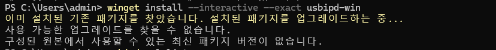
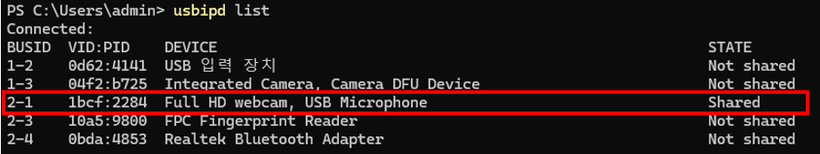
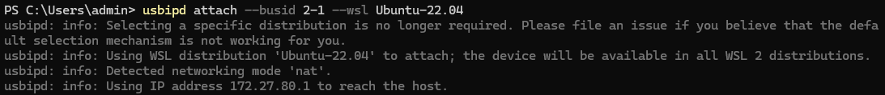
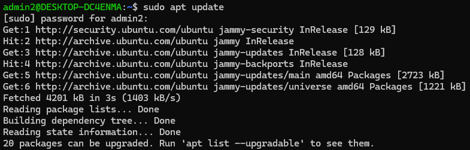
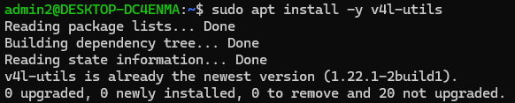
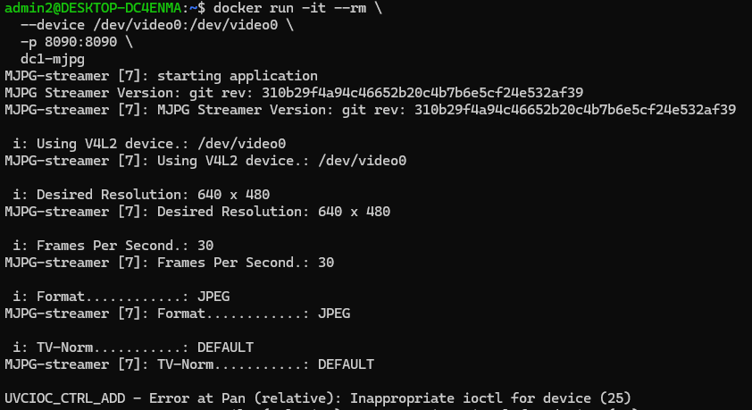

# DC1 도커 컴포즈 구축하기

## 1.이미지 빌드

```bash
docker build -t dc1-mjpg .
```


## 2.USB 카메라를 WSL2에 바인딩하기

### A. Windows에 usbipd-win 설치

- 관리자 권한 PowerShell에서:

  ```powershell
  winget install --interactive --exact usbipd-win
  ```

  

### B. WSL2에 USB 카메라 연결

- 관리자 PowerShell에서 연결 가능한 USB 기기 목록 확인

  ```powershell
  usbipd list
  ```

  


- 목록에서 카메라의 `BUSID` 를 복사한 뒤, WSL2 우분투에 attach

  ```powershell
  usbipd wsl attach --busid <BUSID>
  ```

  -> `usbipd attach --busid 2-1 --wsl Ubuntu-22.04`

  


### C. WSL2 쪽에서 `/dev/video0` 확인

- 파워셸을 닫고, WSL2 터미널에 들어가서

    ```bash
    sudo apt update
    sudo apt install -y v4l-utils
    ls /dev/video*
    # /dev/video0 이 보여야 정상
    ```
    
    1)
    
    
    2)
    
    
    3)
    


### D. 컨테이너 실행

- 컨테이너 올리고 실행하기

    ```bash
    docker run -it --rm \
      --device /dev/video0:/dev/video0 \
      -p 8090:8090 \
      dc1-mjpg
    ```

    
    
    이후 `http://localhost:8090/?action=stream` 으로 접속하면 웹브라우저에 카메라 영상이 나옴.


