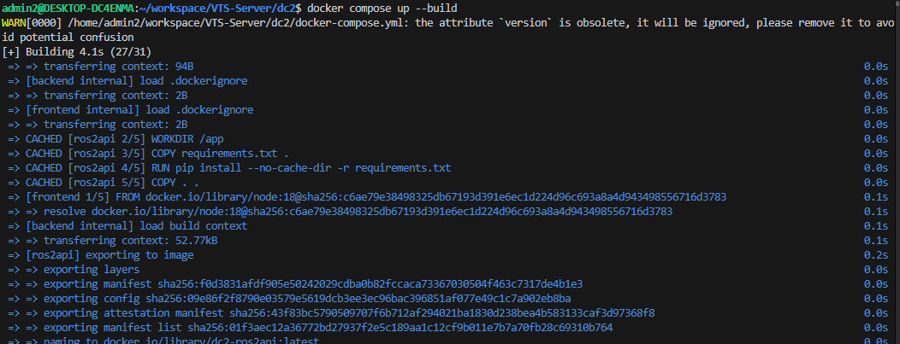

# DC2 도커 컴포즈 구축하기

## 1.도커 컴포즈 빌드

```bash
docker compose up --build
```




### cf. 추가로 알아두어야 할 명령어

- 컨테이너를 종료하려면?

```bash
docker compose down
```


### cf.트러블슈팅

#### [#. React] react-scripts: Permission denied 해결하기

**-> react가 node_modules를 참고해서 빌드해야 하는데 권한이 없는 것이다. 아래와 같이 node_modules 권한을 풀어줘야 한다**

```bash
sudo chmod +x node_modules/.bin/react-scripts
```


## 2.USB 카메라를 WSL2에 바인딩하기

### A. Windows에 usbipd-win 설치

- 관리자 권한 PowerShell에서:


